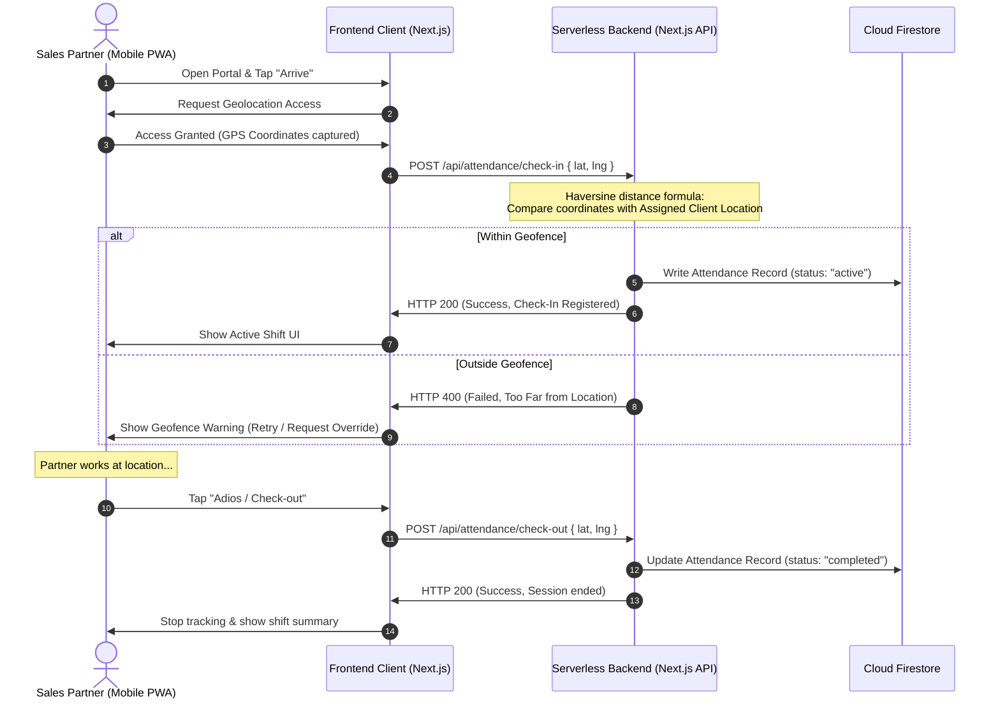

<!--
  Copyright (c) 2026 Biztribe Trading & Consultancy India Private Limited.
  All rights reserved.

  This document is part of the Fractional Sales Partner platform.
  CONFIDENTIAL AND PROPRIETARY — Unauthorised copying, redistribution,
  modification, or use of this document, via any medium, is strictly prohibited.
  Violation will result in civil and criminal prosecution under the
  Copyright Act 1957, Information Technology Act 2000, and applicable
  Indian and international intellectual property laws.
-->

# Capability Design: Web & PWA Attendance & Location Tracking

This document outlines the detailed technical plan, database schema, verification logic, and user experience flow for implementing location-aware attendance tracking in the **ScaleFraction** web app/PWA.

---

## 1. Overview & Objective

The objective is to allow fractional sales partners to check in and check out of assigned client locations directly from their mobile browser. The system will:
1. Capture high-accuracy GPS coordinates during check-in/check-out.
2. Validate that the partner is physically present within the client's geofence (e.g., a 100-meter radius).
3. Provide a privacy-conscious "Proof-of-Presence" mechanism during their shift without requiring continuous background tracking (which mobile web browsers restrict).

---

## 2. Deal-Based Check-In UI Context

Instead of a generic check-in portal, partners check in **directly from the active Deal post card** on their feed or active deals tab. A deal is active when the post status is marked as closed/finalized (`post.paymentStatus === 'sold'`).

### Contextual Entry Points (on the SPPostCard)
* **Visibility:** The check-in actions are only visible to the assigned **Sales Partner** on the deal:
  * For **OBO Posts** (Opportunity): The responding partner whose offer was accepted (i.e. `currentUid === post.paymentLockedBy`).
  * For **SP Posts** (Service): The original post owner/partner (i.e. `currentUid === post.ownerUid`).
* **UI Controls:** An **"Attendance" (MapPin icon)** action button is shown next to the **"Capture Lead"** button in the post header.
  * Clicking "Attendance" opens the slider/drawer to check in.
  * If checked in, it displays a pulsing green **"Active Shift"** indicator with a stopwatch timer. Clicking it triggers the **"Check Out / Adios"** screen.

### Contextual Geofencing Centers
Depending on the deal's nature, the center coordinate for the geofence validation is determined dynamically from the post:
1. **Event Deals (SP Post Type):** The geofence is centered around the **Event Venue** coordinates (`post.venue` lat/lng metadata). Check-in validates that the partner is at the convention/trade show.
2. **Corporate Deals (OBO Post Type):** The geofence is centered around the **Client's Office / Headquarters** coordinates (`post.ownerUid`'s profile company location lat/lng).

---

## 3. The Check-In / Check-Out Workflow



---

## 4. Geofencing & Distance Verification Logic

Since validation happens server-side, the API endpoint will calculate the physical distance between the partner's GPS coordinate and the client office location using the **Haversine formula**.

### Distance Calculation Helper
```typescript
function calculateDistance(lat1: number, lon1: number, lat2: number, lon2: number): number {
  const R = 6371e3; // Earth's radius in meters
  const phi1 = (lat1 * Math.PI) / 180;
  const phi2 = (lat2 * Math.PI) / 180;
  const deltaPhi = ((lat2 - lat1) * Math.PI) / 180;
  const deltaLambda = ((lon2 - lon1) * Math.PI) / 180;

  const a =
    Math.sin(deltaPhi / 2) * Math.sin(deltaPhi / 2) +
    Math.cos(phi1) * Math.cos(phi2) *
    Math.sin(deltaLambda / 2) * Math.sin(deltaLambda / 2);
  
  const c = 2 * Math.atan2(Math.sqrt(a), Math.sqrt(1 - a));

  return R * c; // Distance in meters
}
```

---

## 5. Firestore Database Schema

 We will store attendance logs in a top-level `/attendance` collection.

### Collection `/attendance`
```json
{
  "id": "att_9876543210",
  "partnerId": "usr_partner_12345",
  "partnerName": "Hrushikesh Pangarkar",
  "clientId": "cli_acme_corp",
  "clientName": "Acme Corp Headquarters",
  "date": "2026-07-12",
  "checkIn": {
    "timestamp": "2026-07-12T09:00:00Z",
    "geopoint": {
      "latitude": 18.5204,
      "longitude": 73.8567
    },
    "verified": true,
    "distanceFromCenterMeters": 14.5
  },
  "checkOut": {
    "timestamp": "2026-07-12T17:30:00Z",
    "geopoint": {
      "latitude": 18.5209,
      "longitude": 73.8562
    },
    "verified": true,
    "distanceFromCenterMeters": 42.1
  },
  "status": "completed", // "active" | "completed" | "flagged"
  "totalDurationMinutes": 510,
  "overrideReason": null // Set if check-in was allowed outside geofence with supervisor approval
}
```

---

## 6. Web/PWA "Proof-of-Presence" Strategy (Mitigating Background Limits)

Because mobile browsers do not allow the web app to run background scripts indefinitely, we will use a **multi-pronged presence verification model**:

1. **Active Event Pings:**
   Whenever the partner interacts with the application (e.g., scans a visiting card, adds a lead, updates a deal ledger entry, saves a note), we automatically append the current GPS coordinates to that action. This provides an audit trail of their location throughout the shift.
2. **Idle Periodic Pings:**
   If the browser remains open in a background tab, a Web Worker periodically attempts to capture the location every 15 minutes, pushing it to `/api/attendance/ping`. If the browser suspends the worker, we catch up once they re-open the screen.
3. **Random Presence Checks (Notifications):**
   The backend can trigger a periodic SMS/WebPush notification: *"Are you still at Acme Corp? Please tap to verify."* Clicking the notification opens the portal, captures their GPS, and marks them present.

---

## 7. Premium UI Design & Integration: The Frictionless Check-In Experience

To make checking in an enjoyable, fluid experience rather than an administrative chore, we utilize **tactile gestures, smart location pre-fetching, and micro-interactions** that minimize effort to **one action** (under 2 seconds).

### A. Tactile Swipe-to-Check-In Gesture (Preventing Errors with 0 Form Fields)
Instead of dropdowns, forms, or confirmation dialogs:
* The user is presented with a sleek, horizontal capsule slider: **`Slide to Arrive`** (or **`Slide to Depart / Adios`**).
* **The Experience:** Sliding is powered by spring-physics animations. When they slide it to the right:
  1. The slider tracks their thumb with a smooth, resistive drag.
  2. Upon reaching the end, it triggers a subtle device haptic vibration (supported on mobile browsers) and locks into place.
  3. The capsule morphs into a pulsing green stopwatch status bar: **`Active Shift: 00:00:01`**.
* **Zero Overhead:** Because the context is tied to the **Deal Post**, the system already knows their ID, their client's ID, and the geofence center. No selection forms are needed.

### B. Proactive Location Pre-Fetching (Instant Validation)
* **How it works:** When the partner opens the ScaleFraction app, it silently requests a low-power location ping in the background.
* **If they are near the venue/office:** The app pre-validates their distance.
* **The "One-Tap" Smart Banner:** A micro-widget slides up from the bottom of their dashboard:
  > *"Looks like you arrived at Acme Corp. Tap to Check In."*
  Tapping it completes the check-in immediately. The GPS is already resolved, reducing wait time to **zero**.

### C. Live Radar Scanning Animation (Visual Wow Factor)
To make the 1-second GPS resolution feel interactive:
* During scanning, the MapPin icon turns into a glowing beacon emitting circular, indigo waves (`animate-ping`) outward.
* Once the server confirms the geofence distance, the wave collapses into a solid, vibrant emerald checkmark with a springy bounce effect.

```carousel
```
#### Arrive Screen (Slide to Check-In)
* Background: Deep Obsidian (#0d0e12)
* Interactive indigo slider capsule with `Slide to Arrive` text.
* Map icon with subtle pulse waves showing distance to the target location.

<!-- slide -->
#### Scanning Geofence
* Radar rings expand outward representing the background GPS pre-fetch.
* Status text: "Securing location lock..." in Celestial Blue (#73b9f5).

<!-- slide -->
#### Active Shift Status (Slide to Depart)
* Displays a running stopwatch showing elapsed hours.
* Lock icon turns green, indicating: "Verified on-site: Acme Corp"
* Slide gesture changes to: `Slide to Depart` / `Adios`
```

---

## 8. Security & Anti-Spoofing Guidelines

To prevent GPS spoofing extensions or manual mock locations:
1. **Accuracy Threshold Filtering:** Ignore location data where the accuracy field (`coords.accuracy`) is greater than **50 meters**. This prevents low-resolution cellular-tower pings or spoofed wide-area coordinate sets.
2. **Velocity Checks:** Calculate the travel speed between check-in, periodic pings, and check-out. If a partner checks in at Location A and pings 15 minutes later at Location B (100km away), the system flags the record.
3. **Server Time Enforcement:** All timestamps are written using server-side timestamps (`firestore.FieldValue.serverTimestamp()`) rather than the user's local phone time to prevent clock manipulation.
