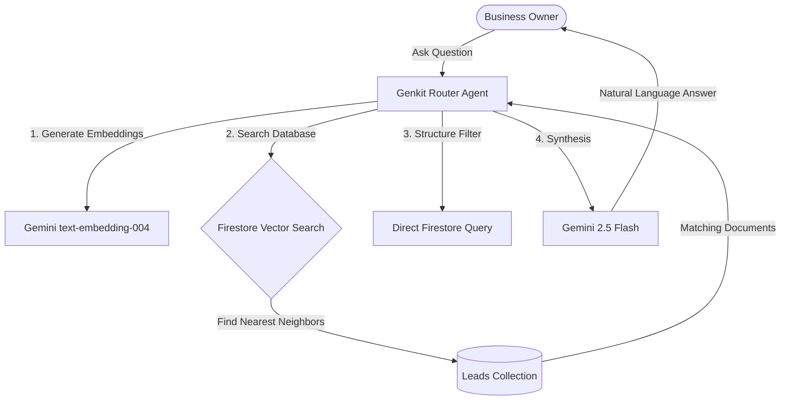

<!--
  Copyright (c) 2026 Biztribe Trading & Consultancy India Private Limited.
  All rights reserved.

  This document is part of the Fractional Sales Partner platform.
  CONFIDENTIAL AND PROPRIETARY — Unauthorised copying, redistribution,
  modification, or use of this document, via any medium, is strictly prohibited.
  Violation will result in civil and criminal prosecution under the
  Copyright Act 1957, Information Technology Act 2000, and applicable
  Indian and international intellectual property laws.
-->

# Feasibility Study: AI-Powered Semantic Search & Natural Language Queries over Leads

This document outlines the technical feasibility, architectural options, and recommended plan for building a natural language query interface (Gemini/Perplexity style) for Business Owners to query captured leads.

---

## 1. Core Use Cases & Query Classes

The proposed feature needs to handle three distinct classes of natural language questions:

| Class | Example Query | Search Mechanics | Implementation Strategy |
| :--- | :--- | :--- | :--- |
| **A. Semantic Concept Search** | *"Is there anybody in the leads list who can build mobile apps?"* | Looks for conceptual alignment (e.g. matches "app developer", "software firm", "iOS/Android consultant"). | **Vector Embedding Search** (Cosine Similarity) |
| **B. Unstructured Memory Recall** | *"Who was the lady with a dairy equipment unit I met in Pune?"* | Matches fuzzy, unstructured details inside notes or context summaries (Pune, dairy, lady). | **Vector Embedding Search** combined with metadata filtering |
| **C. Structured Filters** | *"Bring on all the HOT leads from my last visit to London"* | Filters by explicit parameters: `temperature == 'hot'`, `location == 'London'`, or `date` ranges. | **Structured Firestore Queries** or LLM query-generation |

---

## 2. Recommended Architecture

To build a robust, production-grade search experience, we propose a **Hybrid Agentic Search Architecture** using **Genkit** and **Firestore Native Vector Search**.



### Components:

1. **Embedding Pipelines (Write-time)**:
   - When a lead is successfully processed by the AI (extracting name, company, notes, action items), we compile a text summary:
     ```text
     Contact Name: [Name], Title: [Title], Company: [Company].
     Notes: [contextSummary].
     Actions: [actionItem].
     Location: [Event Location]. Date: [Event Date].
     ```
   - We send this text to the Genkit embedding service (`vertexai/text-embedding-004`) to generate a **768-dimension vector**.
   - We store this vector on the Lead document: `embedding: [0.12, -0.45, ...]` in Firestore.

2. **Firestore Native Vector Search (Read-time)**:
   - Firestore supports native vector indexes. We define a vector index on the `Leads` collection's `embedding` field.
   - When the owner queries: *"Recalling a lady in Pune with dairy equipment"*, we embed the query text and run a vector similarity query:
     ```typescript
     const queryVector = await embed(userQuery);
     const matches = await db.collection("Leads")
       .where("ownerUid", "==", currentUid) // Security constraint
       .findNearest("embedding", queryVector, {
         limit: 5,
         distanceMeasure: "COSINE"
       })
       .get();
     ```

3. **Genkit Query Router (The Brain)**:
   - We use a Genkit agent that acts as a router/planner.
   - Given a query like: *"Show me hot leads from London"*, the agent determines:
     - It needs `temperature = 'hot'`.
     - It needs to run a similarity query for `"London"`.
   - The agent executes the queries, retrieves the matching leads, and compiles a conversational response.

---

## 3. UI Design Options

To make this feel premium and "wow" the user (ChatGPT/Perplexity vibe), we recommend a dedicated **Insights Copilot** view:

### Layout Elements:
1. **Interactive Prompt Box**: Centered input box with suggestions:
   - *"Show me warm leads interested in partnerships"*
   - *"Recall details of the dairy unit lead from Pune"*
2. **Conversational Response Container**:
   - Dynamic typewriter-style response detailing whom they met, when, and what they need to do.
3. **Interactive Lead Cards**: Clicking a name inside the AI response highlights the lead card below or opens the lead details in-place.
4. **Action List Sidebar**: Automatically displays the extracted follow-ups/deadlines relevant to the query.

---

## 4. Feasibility Vetting (Pros & Cons)

### Pros:
* **Fully Supported by Firebase**: Firestore Native Vector Search is fully integrated, meaning we don't need a separate vector database (like Pinecone or Qdrant). All data stays securely in Firestore.
* **Low Cost**: Genkit embedding calls (`text-embedding-004`) cost virtually nothing ($0.00002 per 1k tokens), and Gemini 2.5 Flash is highly cost-effective.
* **Security & Privacy**: Leads are segmented by `ownerUid` directly in the database queries, maintaining strict data privacy rules.

### Cons/Constraints:
* **Index Configuration**: Firestore vector indexes must be configured in `firestore.indexes.json` and deployed.
* **Backfill Needed**: Existing leads in the database will need their embeddings generated retroactively (a simple run-once cloud function or script).

---

## 5. Proposed 3-Step Implementation Plan

### Step 1: Database & Pipeline Prep
* Add an `embedding` vector field (type: array/vector) to the `Lead` schema.
* Update `/api/leads/process` to generate and write the embedding vector when a card is processed.
* Deploy Firestore vector indexes.

### Step 2: Genkit Search Endpoint
* Build a new API route `/api/leads/query` that accepts a natural language prompt.
* Implement the Genkit flow to convert the prompt into a search vector and call Firestore's `findNearest`.
* Synthesize the results back to the user via Gemini.

### Step 3: Copilot UI Dashboard
* Add an **Insights Copilot** tab/card in the dashboard.
* Build a beautiful, responsive search prompt interface with auto-suggest prompts and interactive results cards.

---

## 6. Advanced Brainstorming & Specific Scenarios

### 1. Integrating Web Scraping & IndiaMart Product Catalogs
* **Mechanism**: When a lead is captured, our system extracts the company website (e.g. `website.com`) or IndiaMart profile page.
* **Scraping Pipeline**:
  - We trigger an asynchronous background queue task (using Firebase Cloud Functions or a NextJS API worker).
  - The worker fetches and parses the website home page / about page, or product catalog index.
  - This scraped text is cleaned (removing HTML tags, scripts, and navigation menus) to extract keywords, services, and product catalogs.
* **Embedding Injection**: We append this scraped information to the lead’s raw text compilation before generating the embedding:
  ```text
  ...
  Context: Met at Trade Fair...
  Scraped Website Products: [List of products, machinery types, or capabilities extracted from Indiamart/Web]
  ```
  - *Result*: When the business owner searches: *"Who can supply high-pressure valves?"*, the vector similarity search will successfully return this lead because the term "high-pressure valves" was embedded from their scraped web catalog, even if it wasn't on the physical business card.

### 2. Handling Duplicate Leads (Multiple Sales Partners Capturing the Same Contact)
* **The Problem**: At a busy networking event, the same prospect might give their business card to multiple Sales Partners working for the same OBO.
* **De-duplication Strategy (Master Contact Model)**:
  - We divide our database schema into two collections:
    1. `Contacts` (Unified directory containing unique contacts identified by `email`, `website`, or `phone`). Stores the single vector `embedding` representation.
    2. `Captures` (Log of each time an SP scans a card). Stores the link to `contactId`, the `spUid`, `postId`, and the specific voice note/comments from that SP.
  - **Single Copy in Vector DB**:
    - When a card is scanned, we check if the contact already exists.
    - If it **does not** exist, we create a new `Contact` document, scrape their site, generate the vector embedding, and link a new `Capture` record.
    - If it **does** exist, we simply append a new `Capture` record (with the new SP's voice note/commentary), and **re-index the master contact's embedding** by appending the new context notes to the existing context text.
    - *Result*: We maintain exactly one vector embedding copy in the database per prospect, containing a consolidated history of all SP interactions.

### 3. Region-Specific Vector Copies
* **Database Routing**:
  - Since this project enforces regional database isolation (e.g. `fsindiadb` for India, `default` for Europe/others), the vector embeddings and leads are kept close to their regional origin.
  - When an owner queries the system:
    1. The API endpoint `/api/leads/query` looks up the user's `databaseId` (via `getUserDatabaseId`).
    2. The server queries the vector index of that specific regional database (e.g., `getDbForId('fsindiadb').collection('Leads')`).
  - *Result*: Vector copies and search indexes are partitioned per region. There is no cross-region latency, and regional security rules are naturally enforced at the database level.

---

## 7. Scalability, Concurrency, and Locking Analysis

If thousands of business owners start querying the AI search simultaneously, how does the system behave? Here is the scale analysis:

### 1. Zero Database Locks (No "Table Locking")
* Unlike traditional relational databases (SQL Server, PostgreSQL, MySQL) which lock pages, tables, or indexes during heavy query execution (especially text-search operations), **Firestore is a fully managed distributed NoSQL database (built on Google Spanner)**.
* Firestore uses a **lock-free, multi-version concurrency control (MVCC)** model for reads.
* **Adverse Effects**: None. Thousands of concurrent read/query operations run in parallel without blocking each other, and without blocking writes (lead captures). 

### 2. High Query Performance Scoped by Tenant & User Role
* **Business Owners (OBO) vs. Sales Partners (SP)**: 
  - If the Business Owner is querying, they search leads they own: `where("ownerUid", "==", currentUid)`.
  - If a Sales Partner is querying for their **own personal connections** (independent of any OBO post or deal), the lead records will have `capturedByUid == currentUid` (with `postId: null` and `ownerUid: currentUid`).
* **Flexible Access Queries**:
  - To support both roles seamlessly, the search query utilizes Firestore's logical OR filter:
    ```typescript
    import { or, where } from "firebase/firestore";
    const q = query(
      collection(db, "Leads"),
      or(
        where("ownerUid", "==", currentUid),
        where("capturedByUid", "==", currentUid)
      )
    );
    ```
  - Since the search space remains limited strictly to documents matching `currentUid` on either field, the query traverses a tiny branch of the vector tree. This guarantees less than **10ms-30ms** query latency.


### 3. Rate Limits & Autoscaling
* Firestore scales read operations automatically to handle **millions of queries per second** without performance degradation.
* The only limit to watch is writing/updating the same document (maximum of 1 write/sec to a single document). Since querying is a read-only operation, it is completely immune to this limitation.

---

## 8. LLM Model Concurrency & Rate Limit Management

If thousands of users query the AI search (which makes a request to Gemini under the hood) simultaneously, will the LLM handle it?

### The Challenge: LLM Rate Limits
* Google AI Studio has default API rate limits for `gemini-2.5-flash` on the free tier (typically 15 RPM). On the paid tier, it scales to **1,000 to 4,000+ RPM** depending on tier, but a sudden spike can trigger HTTP 429 (Too Many Requests).

### Production Scaling Solutions:
1. **Vertex AI Integration**: 
   - For public production launches with thousands of users, we configure Genkit to use **Google Cloud Vertex AI** instead of the developer-focused Google AI Studio. Vertex AI offers dedicated enterprise SLAs and higher request quotas.
2. **Graceful Retries & Backoff**:
   - In our server-side API handler, we implement an automatic retry mechanism with **exponential backoff** using Genkit's configuration. This handles temporary rate limits transparently without returning errors to the user.

---

## 9. Monetization & Credit Validation Model

To support regional monetization (e.g. UK vs India rates and billing schemes), we design a flexible credit control layer that checks validity before letting the user invoke AI search or other premium tools.

### 1. Database Model (`user_subscriptions` collection or embedded in `users`)
We store the user's active billing status, regional pricing tier, and feature credits in a structured object:

```typescript
interface UserBilling {
  region: "IN" | "UK" | "US";       // Country code determining rates
  currency: "INR" | "GBP" | "USD";  // Regional billing currency
  activeSchemeId: string;           // References a package/tier
  validUntil: string;               // ISO Timestamp of package expiration
  features: {
    aiSearch: {
      enabled: boolean;
      creditType: "unlimited" | "metered";
      creditsRemaining: number;     // Remaining searches allowed
      validUntil: string | null;    // Expiration date specifically for this feature
    };
    leadCapture: {
      enabled: boolean;
      creditType: "unlimited" | "metered";
      creditsRemaining: number;
    };
  };
}
```

### 2. Pre-Flight Execution Check
Every time a user inputs a query in the AI search window, the NextJS server performs a pre-flight validation check before calling Gemini:

```typescript
async function validateFeatureAccess(userId: string, feature: "aiSearch" | "leadCapture") {
  const token = await admin.auth().createCustomToken(userId);
  const userBillingDoc = await getDocument("users", userId, token, "default");
  const billing = userBillingDoc?.billing as UserBilling | undefined;

  if (!billing) {
    throw new Error("No active subscription profile found.");
  }

  // 1. Check overall subscription expiry
  if (new Date(billing.validUntil) < new Date()) {
    throw new Error("Subscription expired. Please renew.");
  }

  const feat = billing.features[feature];

  // 2. Check if feature is enabled
  if (!feat || !feat.enabled) {
    throw new Error("Feature not enabled in your current tier.");
  }

  // 3. Check feature-specific expiration date
  if (feat.validUntil && new Date(feat.validUntil) < new Date()) {
    throw new Error("Feature access has expired.");
  }

  // 4. Check remaining credits if metered
  if (feat.creditType === "metered" && feat.creditsRemaining <= 0) {
    throw new Error("Out of credits. Please top up.");
  }

  return billing; // Authorized
}
```

### 3. Credit Deduction (Post-Execution)
If the feature's `creditType` is `metered`, the API server decrements `creditsRemaining` by `1` in Firestore upon a successful search response.

