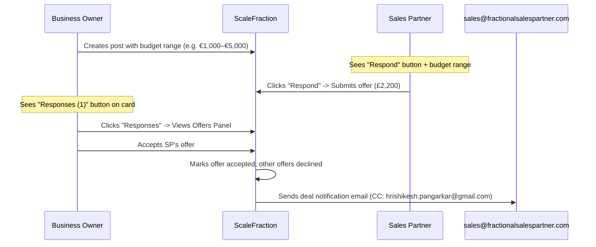

<!--
  Copyright (c) 2026 Biztribe Trading & Consultancy India Private Limited.
  All rights reserved.

  This document is part of the Fractional Sales Partner platform.
  CONFIDENTIAL AND PROPRIETARY — Unauthorised copying, redistribution,
  modification, or use of this document, via any medium, is strictly prohibited.
  Violation will result in civil and criminal prosecution under the
  Copyright Act 1957, Information Technology Act 2000, and applicable
  Indian and international intellectual property laws.
-->

# Offers & Deal Finalization System — Implementation Plan

This document details the implementation plan for Flow B: OBO Posts Budget Range -> Sales Partners (SPs) Respond with Offers -> OBO Finalizes Deal, which sends a notification email.

## Flow Mapping

### Flow A — SP Quotation → OBO Buys (existing)
SPs create posts with fixed packages. OBO pays to lock and confirm. Uses Razorpay integration. No changes needed.

---

### Flow B — OBO Posts Budget Range → SPs "Respond" with Offers → OBO Finalizes "Responses" (NEW)



---

## Data Model

### New Fields on OBO Posts (`Posts` collection, `postType: "obo"`)

```typescript
{
  pricingType: "fixed" | "range" | "open",  // "fixed" = existing fields, "range" = budget range, "open" = name your price
  budgetMin: number | null,                  // e.g. 1000
  budgetMax: number | null,                  // e.g. 5000
  budgetCurrency: string,                    // e.g. "EUR" (USD/EUR/GBP/INR/AUD/CAD)
  acceptingOffers: boolean,                  // true while open
  offerCount: number,                        // denormalized count of active offers
  acceptedOfferId: string | null,            // set when OBO finalizes an offer
}
```

### New Subcollection: `Posts/{postId}/Offers/{offerId}`

```typescript
interface Offer {
  offerId: string;
  postId: string;
  offerorUid: string;
  offerorName: string;
  offerorAvatar: string;
  amount: number;
  currency: string;             // SP's preferred currency (e.g. "EUR", "GBP")
  message: string;              // optional pitch note
  status: "pending" | "accepted" | "declined" | "withdrawn";
  createdAt: string;
  updatedAt: string;
  acceptedAt: string | null;
  declinedAt: string | null;
}
```

---

## UX & UI Changes

### 1. Post Card Header (Top Left corner)
- Move the **Like** action out of the bottom action bar.
- Place a minimalist **Thumb Icon + count** in the top-left area of the card (near the user avatar/title) so users can still like/unlike, but it doesn't take up prime real estate in the action bar.

### 2. Post Card Bottom Action Bar
For OBO posts that have `acceptingOffers: true`:
- **If current user is NOT the owner (Sales Partner):**
  - Show a prominent **"Respond"** button in place of the Like button.
  - Clicking this button opens the `MakeOfferDrawer`.
- **If current user IS the owner (Business Owner/OBO):**
  - Show a **"Responses ({offerCount})"** button in place of the Like button.
  - Clicking this button opens the `OffersPanel` drawer listing all submitted offers.

### 3. "Make an Offer" (Respond) Drawer
A sleek, sliding side drawer for Sales Partners:
- Displays OBO's budget range clearly.
- Pre-fills SP's currency symbol based on their `preferredCurrency`.
- Form validation to ensure offer amount is positive and message is optional.

### 4. "Responses" Panel
A side drawer for the OBO to view incoming offers:
- Lists all offers with applicant names, avatars, and amounts in their native currencies (e.g. `€500`, `£400`).
- Displays the pitch message.
- Provides **[Accept]** and **[Decline]** buttons for each pending offer.
- Prompts a confirmation dialog before finalisation.

---

## Email Notification on Deal Finalization

Uses **Nodemailer + SMTP** to fire a server-side email to `sales@fractionalsalespartner.com` (with CC to `hrishikesh.pangarkar@gmail.com`) once the OBO accepts an offer.

**SMTP Env Settings needed in `.env`:**
```env
SMTP_HOST=smtp.yourprovider.com
SMTP_PORT=587
SMTP_USER=sales@fractionalsalespartner.com
SMTP_PASS=your-app-password
```

---

## Firestore Security Rules

```javascript
match /Posts/{postId}/Offers/{offerId} {
  // Post owner can read all offers; SP can read their own
  allow read: if request.auth != null
    && (request.auth.uid == get(/databases/$(database)/documents/Posts/$(postId)).data.ownerUid
        || request.auth.uid == resource.data.offerorUid);
  
  // SPs can create offers on posts they don't own
  allow create: if request.auth != null
    && request.auth.uid == request.resource.data.offerorUid
    && request.auth.uid != get(/databases/$(database)/documents/Posts/$(postId)).data.ownerUid;
  
  // Post owner can accept/decline; offeror can withdraw
  allow update: if request.auth != null
    && (request.auth.uid == get(/databases/$(database)/documents/Posts/$(postId)).data.ownerUid
        || (request.auth.uid == resource.data.offerorUid 
            && request.resource.data.status == "withdrawn"));
  
  allow delete: if false;
}
```

---

## Design Parameters & Decisions

1. **One Offer Limit**: An SP is restricted to one active offer per post. They can choose to withdraw the offer and submit a new one if they want to modify their bid.
2. **Offer Privacy**: SPs cannot see other SPs' bids or messages. Only the Business Owner (OBO) sees all bids to avoid price undercutting.
3. **Budget Range Visibility**: The OBO's budget range is fully visible to SPs to ensure realistic bids.
4. **Fallback SMTP Handling**: SMTP setup will use placeholder variables. If SMTP credentials are not yet configured in `.env`, the system will log the notification transaction details to server console instead of throwing errors.
